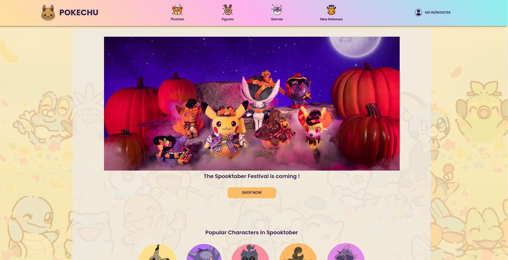

# E-Commerce Pokemon 

O projeto foi construído baseado em um desafio proposto pela empresa Kenzie Academy Brasil, com o objetivo de treinar técnicas de Flexbox para a criação de um e-commerce. Sendo assim, o tema escolhido por mim foi Pokemon.

[Clique aqui para acessar o site](https://julia-otomo.github.io/E-commerce-pokemon/)

## Tecnologias ​🛠️​
- HTML
-CSS
- Git
- Github

## Contato 💻​📱​

> E-mail
julia_otomoduarte@outlook.com

> Linkedin
https://www.linkedin.com/in/julia-otomo-duarte/

## Referências para o projeto
- Site inspirado e produtos: https://www.pokemoncenter.com/;
- ícones presentes no header: https://www.flaticon.com/br/icone-gratis/eevee_188995, https://www.flaticon.com/br/icone-gratis/avatar_1752809, https://www.flaticon.com/br/icone-gratis/avatar_1752867, https://www.flaticon.com/br/icone-gratis/jogos_1752731.
- Imagens de pokemon presentes na index.html: https://www.pokemon.com/br/pokedex/
